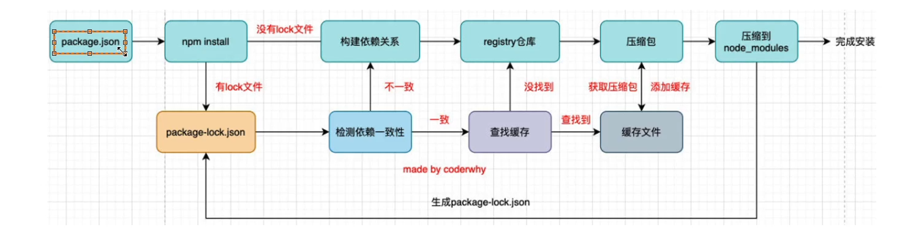

## 好的博客
https://dev.to/shree_j/how-npm-works-internally-4012
https://cloud.tencent.com/developer/article/1555982
## npm install 命令
+ 全局安装 npm install -g : 安装到本机的node指定的全局包文件里，并且将库的可执行命令添加到 本机的环境变量里，如npm install vue-cli -g, 就会将vue 命令添加到本机的环境变量，则所有地方都能使用，要安装到全局的主要是一些工具，如vue-cli脚手架创建工具
+ 项目安装 npm install：安装到当前项目的node_modules，只有当前项目文件下才能使用
## package-lock.json属性
+ version：当前安装在 node_modules中的版本
+ resolved: 库 具体的下载地址
+ integrity: 库 的hash值，来验证已安装的软件包是否改动、是否失效
## 可以通过 npm i --timing=true --loglevel=verbose 或者 npm install package --timing=true --loglevel=verbose 命令看到 npm install 的完整过程
## npm install 安装流程

+ 检查.npmrc文件：优先级为 项目的.npmrc => 用户级的.npmrc => 全局的.npmrc => npm内置的.npmrc
+ 检查项目中有无lock文件
+ 没有lock文件：
  + 从 npm 远程仓库获取库信息
  + 根据dependencies和devDependencies构建依赖关系，如安装axios，里面又依赖了follow-redirects库，
  + 然后从npm registry仓库下载压缩包到本机的npm 缓存目录下的_cacache/content/（可以通过 npm get cache 查看缓存路径）
  + 将压缩包解压到当前项目的node_modules 完成安装，并生成lock文件
+ 有lock文件
  + 检查 package.json 中的依赖版本是否和 package-lock.json 中的依赖有冲突，如果不一致则重新构建依赖关系，如果一致则根据lock中对应的库的integrity 属性 到 cache目录下的_cacache/index-v5 找到对应的库信息（保存着缓存库在本机的文件路径），找到对应库的压缩包 解压到 node_modules文件下

## 其他常用命令

+ 获取npm缓存的仓库地址
  + npm get cache
+ 卸载依赖
  + npm uninstall package
  + npm uninstall package --save-dev
  + npm uninstall package -D 
+ 强制重新安装
  + npm rebuild
+ 清除缓存
  + npm cache clean
+ 命令文档地址：https://docs.npmjs.com/cli/v8/commands

## 历史版本变化
### npm 2.x版本
+ npm2在安装依赖包，采用的是简单的递归安装方法。每一个包都有自己的依赖包，每一个包的依赖都安装在自己的node_modules中，依赖关系层层递进，构成整个依赖树，这个依赖树与文件系统中的文件结构树一一对应。
+ 优点在于 层级结构明显
+ 缺点在于 
  + 如果依赖层级过多，目录会嵌套很多层，导致node—_modules目录会非常庞大，并且可能超过window 系统中 文件路径的最长字符，出现不可预知问题。
  + 而且相同的依赖并没有进行复用，导致许多相同依赖冗余
### npm 3.x版本
3.x将嵌套结构改为扁平结构，即无论直接依赖 还是 依赖的子依赖 都放在node_modules的根目录下

### Npm是怎么解决解决版本冲突
版本冲突是多个包依赖了同一个包，但是依赖的版本不同，这时候就要选择一个版本来安装，我们可以简单的把规则定为使用高版本的那个。
### Npm是怎么解决解决版本冲突