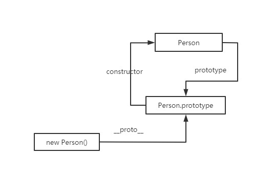
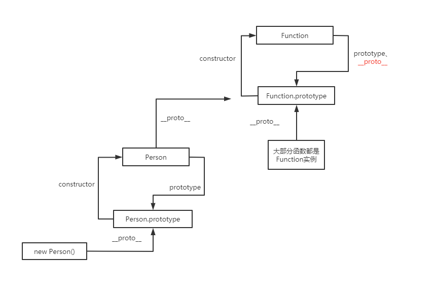
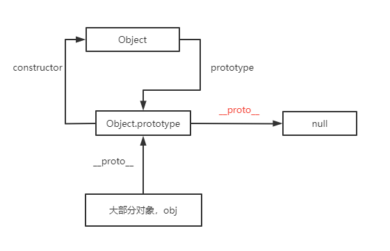
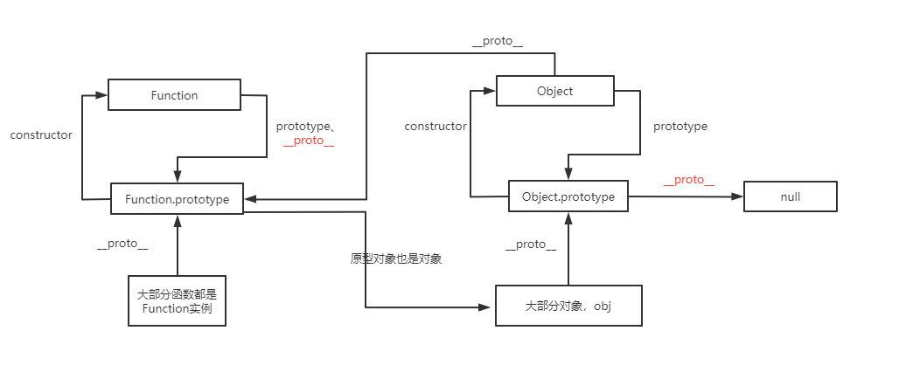
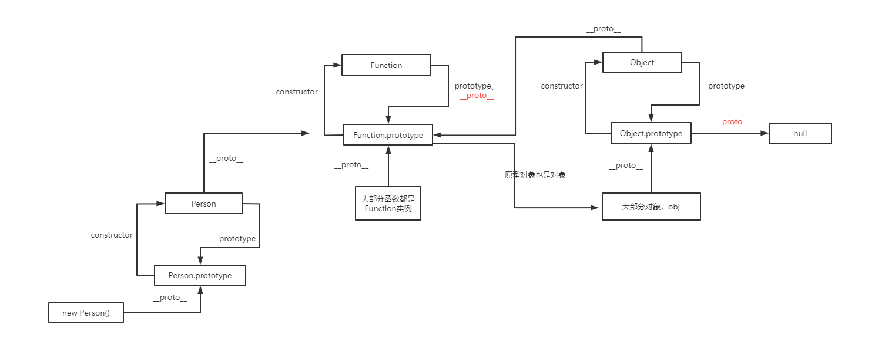
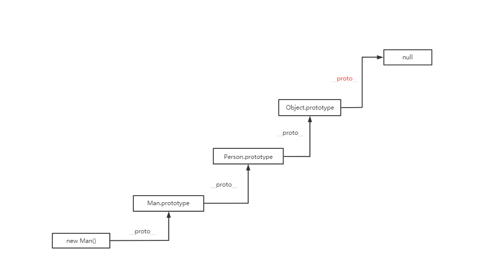

## 原型
+ 每个构造函数都有一个prototype属性，指向它的原型对象，原型对象的constructor则指回构造函数
+ 通过构造函数new 的实例对象，都有__proto__属性，指向构造函数的原型对象
```js
function Person({name, age}) {
  this.name = name
  this.age = age
}
const p = new Person({name: 'fhh', age: 18})
Person.prototype.constructor === Person // 即 构造函数Person.prototype属性 指向 Person的原型对象，Person.constructor指向构造函数Person
p.__proto__ === Person.prototype // 实例的__proto__ 指向构造函数的原型对象 即 instance.__proto__ === Ctor.prototype
```

+ 普通函数是由Function构造出的实例, 而Function比较特殊的地方在于，Function.__proto__指向Function的原型对象
```js
function fn() {}
fn.__proto__ === Function.prototype
Function.__proto__ === Function.prototype
```

+ 大部分对象(包括函数的原型对象)都是Object()的实例，除了 Object.prototype 和 Object.create(null) 创建一个没有任何原型的对象
```js
const obj = {}
obj.__proto__ === Object.prototype
Object.prototype.__proto__ === null
```

+ Function的原型对象亦是 Object的实例，而Object()构造函数亦是Function构造函数的实例, 
```js
Object.__proto__ === Function.prototype
Function.prototype.__proto__ === Object.prototype
```

+ 最终的原型链
  

## 原型链
+ js查找对象属性或方法的过程：当读取对象的某个属性，如果对象本身找不到，则继续查找对象的__proto__属性，如果还是查不到则继续查找对象的__proto__的__proto,直到__proto__为null。
```js
const obj = {}
console.log(obj.a)
// 查找过程为:
obj.a // 没找到,则查找obj的原型对象, 即obj.__proto__
  => obj.__proto__ // 没找到,则查找obj.__proto__obj.__proto__.__proto__
    => obj.__proto__.__proto__ // Object.prototype.__proto__是原型链的顶端，指向null,则不再查找，返回undefined
```
## 那原型链有什么用？
JavaScript的原型链就是该编程语言为了实现面对对象编程的一种设计，基于原型链，可以让JavaScript对象拥有封装、继承和多态等众多面对对象特性。
## 原型继承
```js
function Person() {
  console.log('Person constructor')
  this.type = 'person'
}
Person.prototype.getType = function() {
  console.log(this.type)
}
function Man() {
  console.log('Man constructor')
  this.sex = 'Man'
}
Man.prototype = new Person() // 重写Man构造函数的原型
Man.prototype.constructor = Man // 将构造函数指回 原来的构造函数。constructor可以用于识别由那个构造函数初始化的，最好保证constructor指向的准确性
// Man.prototype === {type: 'person'}
const man = new Man()
man.getType()
```
原型链为 
```js
man.__proto__ === Man.prototype // 所以man可以访问到 Man.prototype.type属性
// 因为Man.prototype是 Person的实例, Man.prototype拥有type属性，并且__proto__ 指向 Person.prototype
Man.prototype.__proto__ === Person.prototype
// 即
man.__proto__.__proto__ === Person.prototype
// 所以Man 的实例 可以访问到 Person.prototype原型对象上的getType方法
```
原型链图


### 为什么要把constructor指回原来的构造函数
即多写了这段代码
```js
Man.prototype.constructor = Man
```
主要是为了保证原型对象 所指向的 构造函数的准确性。
假设有这种场景：在不知道man的构造函数的情况下，想和man使用相同的构造函数创建同类型的新的对象
```js
const man2 = new man.constructor()
```
## 原型链判断
```js
Object.prototype.__proto__=== ?
Function.prototype.__proto__ === ?
Function.__proto__ === ?
Object.__proto__=== ?
Object instanceof Function === ?
Function instanceof Object === ?
```
```js
Object.prototype.__proto__ === null
Function.__proto__ === Function.prototype
Function.prototype.__proto__ === Object.prototype
Object.__proto__ === Function.prototype
Object instanceof Function // true
Function instanceof Object // false

```
## 原型继承的问题

## 常用的与原型相关的方法
因为__proto__属性仅在浏览器环境下才能得到支持，所以不推荐使用，应该用其他方法替代。
### Object.getPrototypeOf(obj) 获取对象obj的[[prototype]]
```js
// 可以通过原型对象的isPrototypeOf方法确定 实例的prototype是否指向原型
Person.prototype.isPrototypeOf(p) // true
// 可以通过Object.getPrototypeOf 获取对象的原型
Object.getPrototypeOf(p) === Person.prototype
//  obj.hasOwnProperty(key)：如果 obj 具有自己的（非继承的）名为 key 的属性，则返回 true。
```
### obj.isPrototypeOf(obj) 检测一个对象是否存在于另一个对象的原型链中
```js
function Person() {
  this.type = 'person'
}
function Man() {
  this.sex = 'Man'
}
const per = new Person()
Man.prototype = per // 重写Man构造函数的原型
Man.prototype.constructor = Man 
const man = new Man()
per.isPrototypeOf(man) // true
// 也可以通过原型对象的isPrototypeOf方法确定 实例的prototype是否指向原型
Person.prototype.isPrototypeOf(per) // true
Person.prototype.isPrototypeOf(man) // true
```
### Obj.hasOwnProperty(key) 检测属性key是否存在obj的自身属性（不包括继承的属性）
```js
man.hasOwnProperty('type') // false
man.hasOWnPrototype('sex') // true
```
### instanceof 用于检测构造函数的prototype是否出现在某实例对象的原型链上
使用：
```js
man instanceof Person
man instanceof Man
```
如果左侧不是引用类型，则返回false
```js
'js' instanceof String // false
null instanceof Object // false
```
instanceof原理实现：
instanceof的概念可以理解为 右侧的prototype 是否在 左侧的原型链上，如果左侧不是引用类型，则直接返回false。
```js
function myInstanceOf(left, right) {
  if(!(left instanceof Object || typeof left === 'function')) return false
  let rightPro = right.prototype
  let leftPro = left.__proto__
  while(leftPro) {
    if(leftPro === rightPro) {
      return true
    }
    leftPro = leftPro.__proto__
  }
  return false
}
const arr = []
console.log(myInstanceOf(arr, Array)) // true
console.log(myInstanceOf(arr, Object)) // true
console.log(myInstanceOf(arr, String)) // false
const obj = {}
console.log(myInstanceOf(obj, Array)) // false
console.log(myInstanceOf(obj, Object)) // true
function Person(){}
const person = new Person()
console.log(myInstanceOf(person, Person)) // true
console.log(myInstanceOf(Person, Function)) // true
console.log(myInstanceOf(Person, Object)) // true
// 原型继承
function Man() {
  this.sex = 'Man'
}
Man.prototype = new Person() 
const man = new Man()
console.log(myInstanceOf(man, Man)) // true
console.log(myInstanceOf(man, Person)) // true
console.log(myInstanceOf(null, Object)) // false
``` 
## 思考题
### 案例一
```js
function fn() {}
Object.prototype.a = function() {
  console.log('a')
}
Function.prototype.b = function() {
  console.log('b')
}
let f = new fn()
// 思考下打印结果
console.log(f.a())
console.log(f.b())
console.log(fn.a())
console.log(fn.b())
```
结果是
```js
a
报错
a
b
```
  结果分析  

  f 是 fn的实例，所以原型链为 
```js
f.__proto__ === fn.prototype 
  => fn.prototype.__proto__ === Object.prototype
```
  
所以 f 可以访问fn.prototype 和 Object.prototype 上的方法和属性,但是原型链上没有Function.prototype,所以访问不了其属性和方法。
  
  fn函数 则是 Function 的实例，即fn = new Function。所以原型链为：
```js
fn.__proto__ === Function.prototype 
  => Function.prototype.__proto__ === Object.prototype
```
## 案例二
```js
function Person() {
  this.type = 'person'
}
Person.prototype = {
  name: 'fhh'
}
const p1 = new Person()
Person.prototype = {
  age: 18
}
const p2 = new Person()
// 思考下打印结果
console.log(p1.name)
console.log(p2.name)
```
结果是：
```js
fhh
undefined
```
结果分析：  
执行new时，会把新对象的__proto__指向构造函数的prototype原型对象, 而原型对象属于引用类型，所以实例的__proto__ 都保存着原来所指向的原型对象的引用。即
```js
p1.__proto__ => {name: 'fhh'}
p2.__proto__ => {age: 18}
```
## 案例三
```js
function Person() {
  this.type = 'person'
  this.messages = ['fhh', '18']
  this.obj = {
    name: 'fhh',
    age: 18
  }
}
function Man() {}
Man.prototype = new Person()
const m1 = new Man()
const m2 = new Man()
const m3 = new Man()
m1.type = 'man'
m1.messages = ['']
console.log(m2.type, m2.messages) // person ['fhh', '18']
m3.messages.push('handsome')
console.log(m2.messages) // ['fhh', '18', 'handsome']
m3.obj.age = 19
console.log(m2.obj) // {name:'fhh', age: 19}
```
当给对象的属性赋值时，如果对象不存在此属性，并且原型链上能找到此属性，会出现三种情况：
```js
let man = new Man()
man.type = 'man'
```
1、如果man原型链上的type属性没有被标记为只读属性，即writable：false，那么会在man对象上添加type属性并赋值
2、如果man原型链上的type被标记为只读，那么无法修改已有属性或者在man对象上创建属性
3、如果原型链上的type是一个setter，则会调用这个setter，type属性也不会添加到man对象上
## Es6的继承
## new原理实现
先看看new做了什么事：
+ 创建了一个新对象
+ 将对象的__proto__指向构造函数的原型
+ 将新对象作为构造函数的上下文，执行构造函数，即函数的this指向了新对象
+ 判断构造函数的返回值类型，如果是原始类型，则返回新创建的对象，如果是引用类型，则返回引用类型的对象

```js
function myNew(fn,...args) {
  const obj = Object.create(fn.prototype)
  console.log('args==',args)
  const res = fn.call(obj, ...args)
  return res !== null && res instanceof Object ? res : obj 
}
```