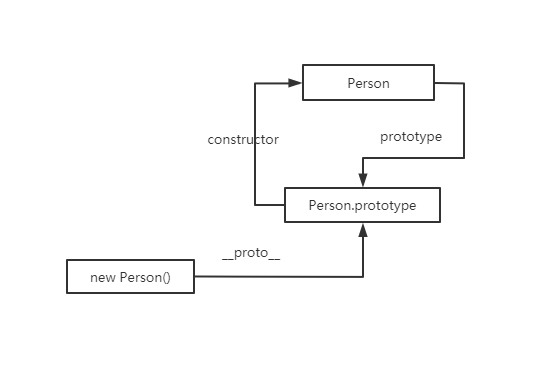
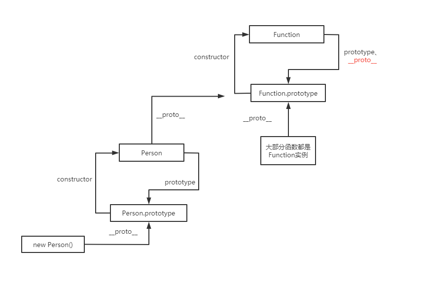
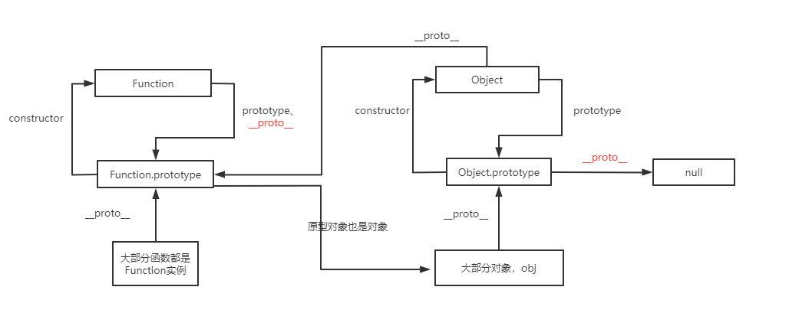
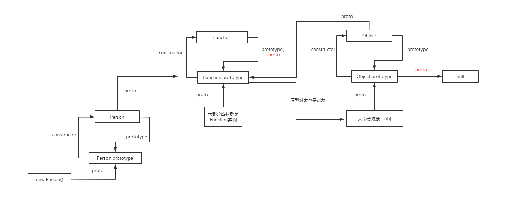
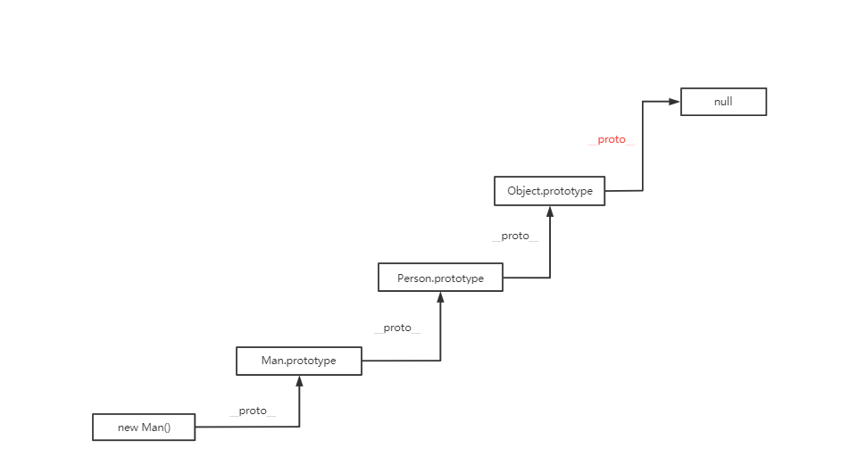

## 原型
+ 每个构造函数都有一个prototype属性，指向它的原型对象，原型对象的constructor则指回构造函数
+ 通过构造函数new 的实例对象，都有__proto__属性，指向构造函数的原型对象
```js
function Person({name, age}) {
  this.name = name
  this.age = age
}
const p = new Person({name: 'fhh', age: 18})
Person.prototype.constructor === Person // 即 构造函数Person.prototype属性 指向 Person的原型对象，Person.constructor指向构造函数Person
p.__proto__ === Person.prototype // 实例的__proto__ 指向构造函数的原型对象 即 instance.__proto__ === Ctor.prototype
```

+ 普通函数是由Function构造出的实例, 而Function比较特殊的地方在于，Function.__proto__指向Function的原型对象
```js
function fn() {}
fn.__proto__ === Function.prototype
Function.__proto__ === Function.prototype
```

+ 大部分对象(包括函数的原型对象)都是Object()的实例，除了 Object.prototype 和 Object.create(null) 创建一个没有任何原型的对象
```js
const obj = {}
obj.__proto__ === Object.prototype
Object.prototype.__proto__ === null
```

+ Function的原型对象亦是 Object的实例，而Object()构造函数亦是Function构造函数的实例, 
```js
Object.__proto__ === Function.prototype
Function.prototype.__proto__ === Object.prototype
```

+ 最终的原型链
  

## 原型链
+ js查找对象属性或方法的过程：当读取对象的某个属性，如果对象本身找不到，则继续查找对象的__proto__属性，如果还是查不到则继续查找对象的__proto__的__proto,直到__proto__为null。
```js
const obj = {}
console.log(obj.a)
// 查找过程为:
obj.a // 没找到,则查找obj的原型对象, 即obj.__proto__
  => obj.__proto__ // 没找到,则查找obj.__proto__obj.__proto__.__proto__
    => obj.__proto__.__proto__ // Object.prototype.__proto__是原型链的顶端，指向null,则不再查找，返回undefined
```
## 原型继承
```js
function Person() {
  this.type = 'person'
}
Person.prototype.getType = function() {
  console.log(this.type)
}
function Man() {
  this.sex = 'Man'
}
Man.prototype = new Person() // 重写Man构造函数的原型
// Man.prototype === {type: 'person'}
const man = new Man()
man.getType()
```
原型链为 
```js
man.__proto__ === Man.prototype // 所以man可以访问到 Man.prototype.type属性
// 因为Man.prototype是 Person的实例, Man.prototype拥有type属性，并且__proto__ 指向 Person.prototype
Man.prototype.__proto__ === Person.prototype
// 即
man.__proto__.__proto__ === Person.prototype
// 所以Man 的实例 可以访问到 Person.prototype原型对象上的getType方法
```
原型链图



## instanceof

## new原理实现
## 常用的与原型相关的方法
```js
// 可以通过原型对象的isPrototypeOf方法确定 实例的prototype是否指向原型
Person.prototype.isPrototypeOf(p) // true
// 可以通过Object.getPrototypeOf 获取对象的原型
Object.getPrototypeOf(p) === Person.prototype
```