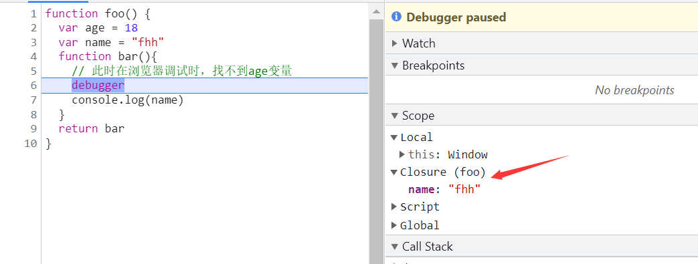

## 闭包
+ 闭包是函数和声明该函数的词法环境的组合。
+ 闭包的两种说法：
  + 从广义角度讲，js中的函数都是闭包
  + 从狭义的角度讲，js中的一个函数，如果访问了外层作用域的变量，则是一个闭包
其实关于闭包的概念很多，并且都大同小异，个人觉得没有必要对概念那么纠结，知道怎么使用和使用场景就好啦（当然我个人比较推崇MDN上的说法~）
## 闭包的应用场景
+ 模拟私有变量的实现
```js
const Person = (function() {
  let _weight = 180
  class Person{
    constructor({name, weight}) {
      this.name = name
      _weight = weight
    }
    getWeight(){
      return _weight
    }
  }
  return Person
}())
let my = new Person({name:'fhh', weight: 18})
console.log(my.name, my._weight, my.weight) // fhh undefined undefined
console.log(my.getWeight()) // 只能通过getWeight访问_weight
```
正如不能随便问一个男人体重一样，我们有时候不允许外部随意访问实例的内部变量，像Java可以通过private标识符实现私有变量,
而js就可以用闭包实现。正如上例一样，通过实例直接访问weight是不允许的，只能通过实例方法getWeight获取.
模块化开发也是类似的实现。
```js
let module = (function() {
  let count = 0
  let add = function() {
    count++
  }
  let decrease = function() {
    count--
  }
  let getCount = function() {
    return count
  }
  return {
    add,
    decrease,
    getCount
  }
})()
module.add()
console.log(module.getCount()) // 1
```
+ 实现函数的缓存
```js
function cache(fn) {
  const cache = {}
  return function(...args) {
    const str = JSON.stringify(args)
    // 执行过一次后就会缓存结果，下一次遇到同样的参数就不用重新计算，直接返回之前的结果
    return cache[str] || (cache[str] = fn.call(fn, ...args))
  }
}
const add = function(a,b) {
  return a + b
}
const addCacheWrap = cache(add)
addCacheWrap(1,2) // 执行过一次后就会缓存结果
addCacheWrap(1,2)
```
+ 函数的柯里化
```js
function checkAge(min) {
  return function(age) {
    return age >= min
  }
}
let age = 19
// 通过闭包 保存min变量
// 生成用于检查年龄是否 >= 18 的函数
const check18Age = checkAge(18)
console.log(check18Age(age)) // true
// 生成用于检查年龄是否 >= 20 的函数
const check20Age = checkAge(20)
console.log(check20Age(age)) // false
```
+ 其他应用场景
比如Vue的 响应式实现就有使用到闭包、Vue的单例模式、computed属性的缓存...

## 注 (TODO: 验证)
根据js实现规范，闭包 会保存对外部环境的引用，但是不同的js引擎实现的细节不同，如v8引擎虽然保存着 外部环境的引用，但是会把 没有引用到的变量 清掉

```js
function foo() {
  var age = 18
  var name = "fhh"
  function bar(){
    // 此时在浏览器调试时，找不到age变量
    debugger 
    console.log(name)
  }
  return bar
}
var bar = foo()
bar()
```
